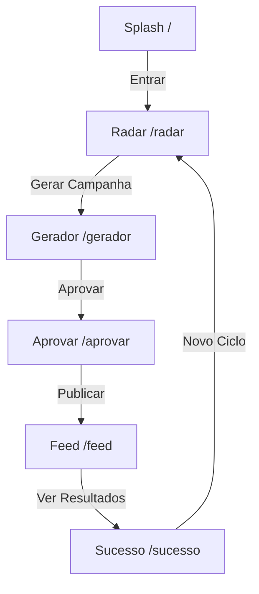

# Fluxo de Páginas do ACE

Esta seção documenta o fluxo de navegação de 6 páginas do **ACE (AutoSales Camp Engine)** refatorado para Next.js 15.

## Visão Geral do Fluxo

O ACE é projetado para que o usuário execute a criação e publicação de campanhas de marketing em 3 cliques:
1. **Splash (Login)**: Entrada no sistema.
2. **Radar**: Identificação e seleção de uma oportunidade sazonal (feriado nacional, estadual ou municipal).
3. **Gerador**: Geração automática por IA de imagens, copys e seleção de canais.
4. **Aprovar**: Revisão de dados e escolha do modo de publicação (Automático/Manual).
5. **Feed**: Visualização de simulação real em dispositivos móveis (Instagram e WhatsApp).
6. **Resultados (Sucesso)**: Acompanhamento de métricas geradas após ativação.

## Diagrama de Navegação

## Arquitetura de Roteamento (Next.js App Router)

Cada página foi refatorada do TanStack File-Based Router para o Next.js App Router sob a pasta `src/app/`:

- `/` -> `src/app/page.tsx`
- `/radar` -> `src/app/radar/page.tsx`
- `/gerador` -> `src/app/gerador/page.tsx`
- `/aprovar` -> `src/app/aprovar/page.tsx`
- `/feed` -> `src/app/feed/page.tsx`
- `/sucesso` -> `src/app/sucesso/page.tsx`
- `/api/holidays` -> `src/app/api/holidays/route.ts` (API de Feriados)
